# Robot RL Portfolio — 双足 → 算法 → Offline RL → 步态 → 人机耦合闭环

> 定位：**通用人形 / 基准 RL 技能验证，外骨骼为前向探索方向**。
> 主线：仿真双足（①）→ 算法族与蒸馏（②）→ 离线学习与微调（③）→ 步态感知与助力（④）→ 相位条件化闭环（④½）——**4 个可复现项目 + 1 个闭环衔接实验（编号 ④½，即项目④的延伸验证）**。
> 每个数字可追溯（脚本 + `results/` 文档）；全部为仿真与公开数据，无外骨骼模型、无人体在环实验；真机验证依赖公司环境。

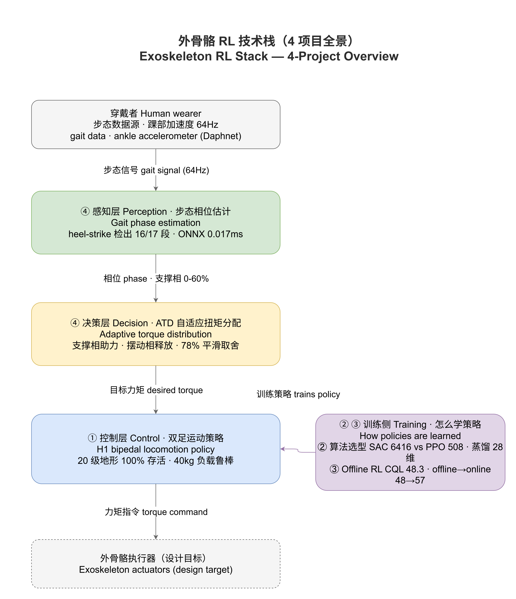

## 项目全景

| # | 项目 | 平台 | 核心成果 |
|---|---|---|---|
| ① | 双足人形运动控制 | Isaac Lab + Unitree H1 | 难度谱 8 代表点全部存活（20 级区分度有限，见①）、40kg 负载鲁棒、能耗（∑\|τ·ω\| 机械功率） |
| ② | 算法族对比 + 蒸馏 | MuJoCo Humanoid-v4 | SAC 6416 vs PPO 508（样本效率 ~40×）、观测削减 92.6% 性能持平 |
| ③ | Offline RL 复现 + 微调 | D4RL + d3rlpy | CQL 48.2±0.2（3 seeds）/ Cal-QL 48.6（超论文 47.0/47.7）、offline→online 48→57 |
| ④ | 步态相位 + 助力增益 | Daphnet 数据集 | 16/17 段检出、助力平滑 78% 权衡 |
| ④½ | 最小人机耦合闭环（①④ 衔接） | Isaac Lab（相位条件化 H1） | 相位锁定 0.986、突变重同步 <0.2s、周期外力存活率 3×（A=200N：0.60 vs 0.20；10 局/格，方向性信号） |

---

**这些项目对应外骨骼技术栈的哪一环**（功能对应关系，未做外骨骼实机验证）：

| 项目 | 外骨骼对应 |
|---|---|
| ① 双足 H1 | 承重负载鲁棒性（外骨骼穿戴场景的仿真验证） |
| ② 算法族对比 | 策略选型（样本效率 → 真机/人体数据昂贵） |
| ③ Offline RL | 用离线数据学习（真实人机数据无法在线采集） |
| ④ 步态相位 | 穿戴者意图感知（ATD 决策层） |
| ④½ 相位条件化闭环 | ④ 的输出接进 ① 的输入：穿戴者节律 → 条件化策略（信号通路级） |

---

**动态证据**：[SAC 走路 Demo 视频（33s，6416 分）](assets/demo_sac.mp4)（MuJoCo Humanoid）。

## 目录

- [项目 ① 双足人形运动控制（Isaac Lab + Unitree H1）](#p1)
- [项目 ② 算法族对比 + Teacher-Student 蒸馏（MuJoCo）](#p2)
- [项目 ③ Offline RL 复现 + 微调（D4RL）](#p3)
- [项目 ④ 步态相位估计 + 助力增益（Daphnet）](#p4)
- [项目 ④½ 最小人机耦合闭环（相位条件化 H1）](#p4half)
- [环境 / 复现 / Windows 环境搭建笔记 / Debug 记录](#env)

## 仓库结构

- `scripts/` 训练 / 评估 / 绘图脚本（项目②③④ 全部 + 项目① 评估）
- `results/` 全部结果文档（每张图表可对应）
- `assets/` 图与演示视频
- `phase_conditioned/` 项目④½ 闭环实验（脚本 + 检查点 + 结果）
- 仓库根目录 = 项目② 的模型权重（PPO/BC/DP/ACT/SAC/蒸馏学生，复现命令见下）

<details>
<summary>算力账（时间线可审计性 · 点击展开）</summary>

> 本仓库 4 个项目均在 2026 年 8 月一个月内完成，机时公开供对账。
> 硬件：RTX 4090 Laptop 16GB（个人笔记本）。模式：夜间过夜队列 24/7 + 白天评估（2026-08-05 首个实验日志起）。

| 项目 | 训练作业 | 实测机时 | 对账依据 |
|---|---|---|---|
| ① Isaac Lab | 16 次训练 launch（flat×3 / rough×3 / nodr / noactrate / torquepen / payload×3 / phase×2） | **12.4 GPU-hours** | 日志目录启动时间 → 最后检查点 mtime |
| ② MuJoCo | PPO 2M + SAC 2M + BC / DP / ACT×4 + 蒸馏学生 | ~10.5h（文档记录值） | evals_summary §9、act_vs_bc §5、dp_train.log（7s 实测） |
| ③ D4RL | CQL 3-seed + Cal-QL + RLPD + SAC 对照 + mr CQL/CalQL + 切分点评估 + 3-seed 补跑 | **64.7 GPU-hours**（原跑 26.9 + seed 补跑 25.6 + seed3 ~11 + 误跑 1.2） | d3rlpy 日志 ISO 时间戳 |
| ④ 步态 | Daphnet 信号处理 | CPU，无 GPU 占用 | run_daphnet.py |

完整逐次对账表：[compute_ledger.md](compute_ledger.md)（`scripts/compute_ledger.py` 扫描日志生成，可复核）。

**一个月可行的机制**：GPU 过夜队列 24/7 + 各项目协议复用（统一 10 局确定性评估、同环境基准共享）。
单次训练实测：Isaac flat ~40 分钟、rough ~1.5-2h；SAC 2M 步 ~10h；CQL 400k 单 seed ~4h；ACT ~2 分钟。

</details>

---

## <a id="p1"></a>项目 ①：双足人形运动控制（Isaac Lab + Unitree H1）

NVIDIA Isaac Lab + RSL-RL（PPO）训练 H1 速度跟踪策略：平地 → 崎岖（地形课程 + 域随机化）→ 验证。

*图注顺序：难度-性能 → 负载-性能 → 训练收敛。*

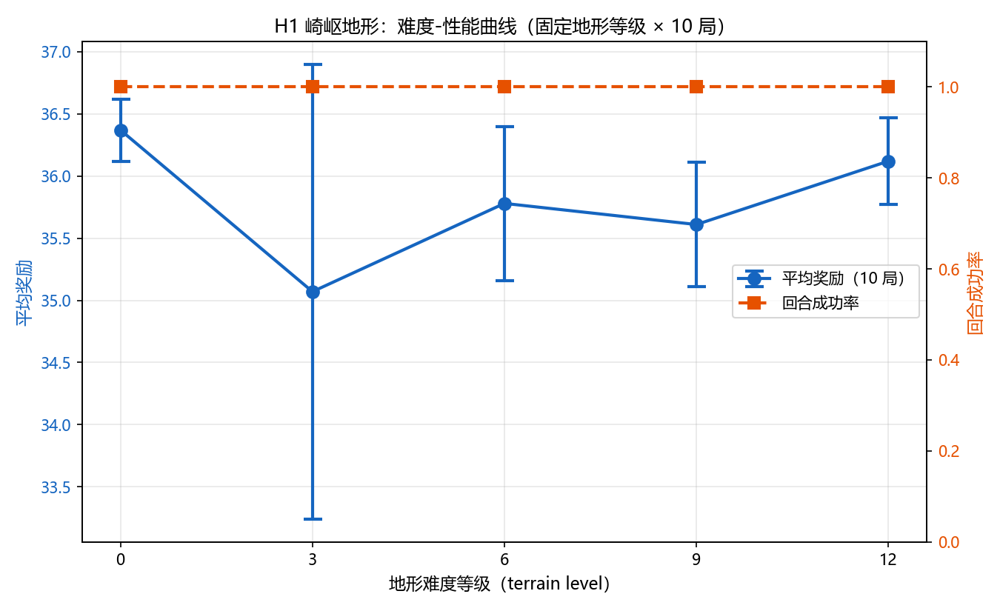
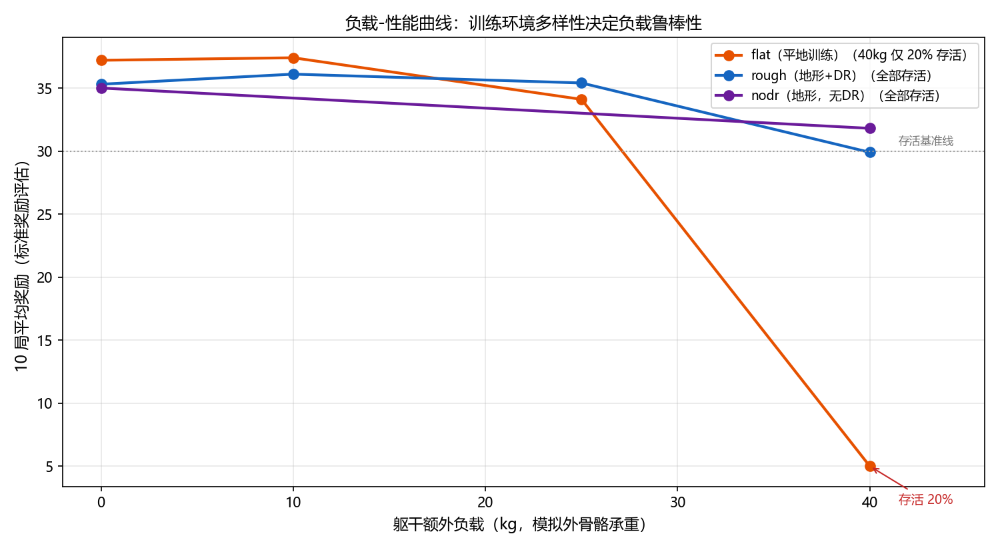
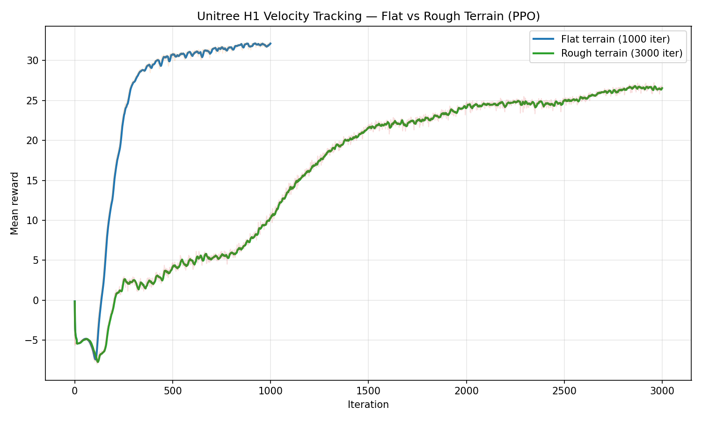

| 实验 | 结果 | 结论 |
|---|---|---|
| 难度-性能曲线 | 20 级难度谱抽 8 代表点（0→19 全跨度）**全部 100% 存活**，奖励 35-36.4 零衰减 | 地形自适应步态 |
| 负载 0-40kg | flat 40kg 崩（20%），rough/nodr 40kg 仍 100%（29.9/31.8） | flat 训练 40kg 失效，rough/nodr 训练保持 100% |
| 负重训练（+25kg） | 25kg 下 37.6（恢复无负载水平）vs 通用 34.1 | 为承重场景专门训练 |
| 奖励敏感性 | 强力矩惩罚**完全崩**（0% 存活） | 力矩惩罚权重存在存活临界点 |
| DR 消融 | nodr 35.0 ≈ rough 35.3 | 动力学 DR 影响小，地形是泛化主因 |
| 能耗（∑\|τ·ω\| 机械功率） | +25kg 功率 +10%（328 vs 297W）；崎岖 0.175 vs 平地 0.126 reward/W | 奖励未含功率项，+25kg 能耗代价约 +10% |
| 能耗 COT 归一化（2026-08-15） | 机械 COT 1.304（0kg）→ 1.042（+25kg）；载重后总功率 +7.4%（非节能） | 单位质量运输成本降；口径边界见 [results/cot_normalized.md](results/cot_normalized.md) |

> COT 口径补充：直线恒速模式（名义 1.0 m/s），实测总质量 51.4kg、实测速度 0.626/0.566 m/s——速度/质量/功率三因子分解与口径坑见 `results/cot_normalized.md`。
> 指令跟踪曲线（固定 1.0 m/s 直线，实测速度来源）：
>
> 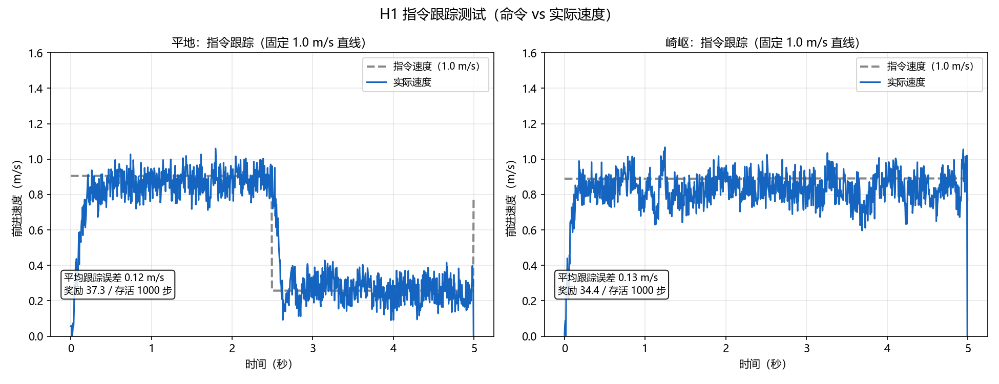

> 难度谱说明：评估通过写入 `terrain_levels` 张量 + 重置 + **读回 observed 验证**（`observed == requested`，见 `results/evals_summary.md` §1 与 eval 日志），等级真实生效。0→19 级难度增量对"存活 + 速度跟踪奖励"这一度量的区分度有限——训练课程推进到 level 5.8 后，更高等级仍全存活且奖励无衰减，部分是难度谱度量特性（高等级地形对 H1 通过性不构成瓶颈），非策略在全部难度都经过训练。

**ONNX 导出与推理延迟**（`scripts/export_h1.py` 导出 JIT/ONNX 并内置数值一致性校验，基准见 `results/inference_latency.md`）：CPU 推理 flat 0.017ms / rough 0.037ms（mean，2000 次计时），**策略耗时占 1kHz 周期预算 1.7%**（0.017ms/1ms；不含状态估计/通信/执行器延迟），且 JIT vs ONNX 输出一致性 MSE ~1e-13（无算子精度损失）。

---

## <a id="p2"></a>项目 ②：算法族对比 + Teacher-Student 蒸馏（MuJoCo Humanoid-v4）

同环境、同评估协议对比 on-policy / 模仿学习 / 生成式 / off-policy 四类算法，并做传感器最少化蒸馏。

*图注顺序：五算法对比（log 轴）→ ACT vs BC 双面板 → SAC 样本效率 → 蒸馏架构。*

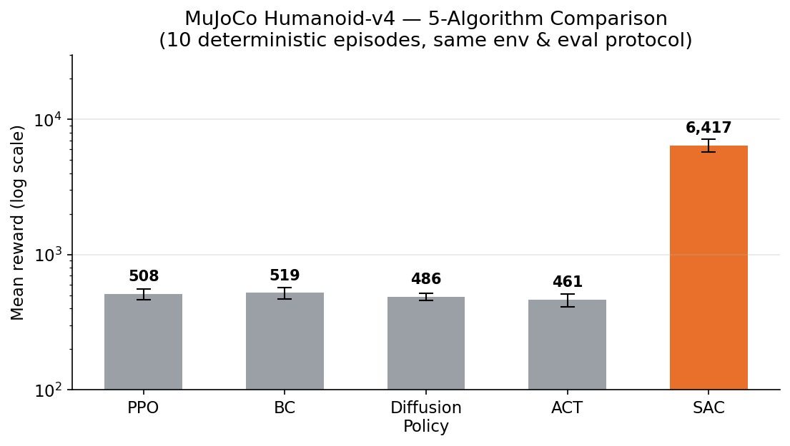
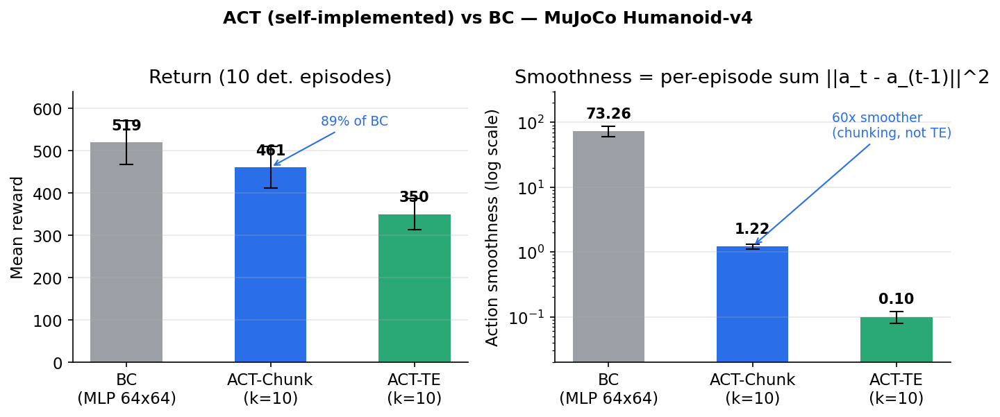
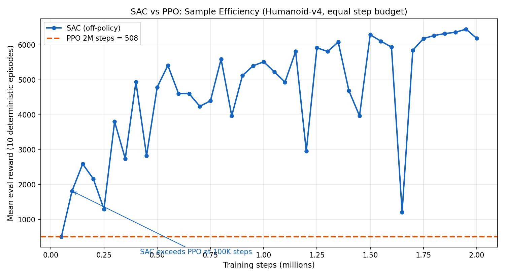
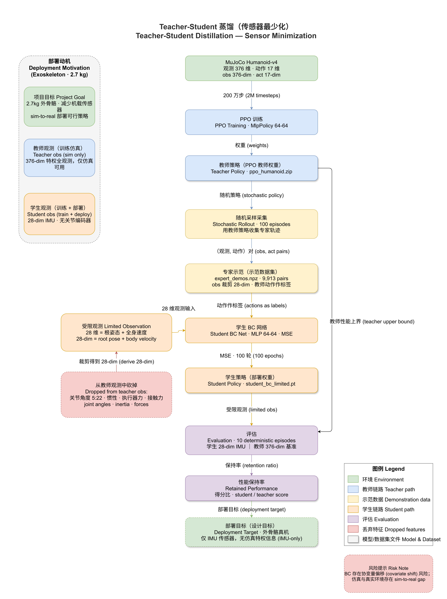

*样本效率图注：SAC 训练过程评估曲线（eval callback，`assets/sac_logs/evaluations.npz` 可复现）——5 万步 ≈504 已接近 PPO 2M 步水平，10 万步超过；最终独立评估 6416.8 见上表。*

**SAC 走路 Demo（33s，6416 分）**：见上方"动态证据"链接。视频是 MuJoCo Humanoid 走路（非 H1——Isaac Sim 渲染崩溃的 workaround，见 Debug ②）。

| 算法 | 预算 | 平均奖励 |
|---|---|---|
| PPO（on-policy） | 2M 步 | 508.3 ± 47.3 |
| BC（模仿学习） | 9913 条示范 | 519.0 ± 51.1 |
| Diffusion Policy（DDPM 自实现） | 9913 条示范 | 485.7 ± 30.4 |
| ACT（自实现三件套，chunk k=10） | 9913 条示范 | 460.8 ± 49.8 |
| **SAC（off-policy）** | 2M 步 | **6416.8 ± 711.8** |

- **样本效率**：同 2M 步预算下 SAC 5 万步即接近 PPO 2M 步水平、10 万步超过（"接近"口径 ~40×、严格口径 20×，off-policy 样本效率优势；外骨骼真机数据贵，样本效率直接对应采集成本）；PPO/SAC 均为默认超参未单独调优，对比目标是样本效率而非绝对分数（单 seed 训练 + 10 局确定性评估；① 侧有 3-seed 统计）；**DP 适用边界**：近单峰分布优势不显（485.7 vs BC 519）
- **ACT 自实现**（chunking / CVAE / temporal ensemble 三件套手写，非官方 repo）：回报达 BC 的 89%，**动作平滑度 73.3 → 1.2（60×）**，k 是"平滑 vs 跟踪"的旋钮（k=25 平滑度 0.25 但回报 296）。CVAE 后验在本数据坍缩（PPO 确定性教师无多模态可建模，KL→0 且与 β 无关）；完整权衡曲线与机制分析见 [results/act_vs_bc.md](results/act_vs_bc.md)，**未复现官方 visuomotor 任务**（边界声明见同文档）
- **DP 部署权衡（DDIM）**：DDPM-100 单动作 143 ms（实时预算不可行）→ DDIM-5 降到 10 ms、均值性能不降（520 vs 490），**但单局标准差 3.7×（方差 ~14×）**（少步采样对初值/观测扰动更敏感）——剩余延迟靠 chunking 摊销，正是 ACT 的设计动机；完整表见 [results/ddim_latency.md](results/ddim_latency.md)
- **Teacher-Student 蒸馏**：教师（PPO 全 376 维观测）→ 学生（受限 28 维：根姿态 + 全身速度——真机可经 IMU 融合/编码器获得的可部署观测子集），性能持平（534.4 vs 508.3，±std 内）。**教师选型说明**：用 on-policy PPO 当教师是蒸馏文献的标准设置；教师未饱和（508）反而使"学生持平教师"的结论保守（教师已饱和则蒸馏增益无从体现），SAC（6416）当教师的对照列为后续工作（2026-08-15 已跑，阴性）：SAC 教师蒸馏系统性失败（受限/全观测、随机/确定性示范四变体保持率仅 5-9%），机制假说=学生能继承静态映射的性能、继承不了高增益反馈策略的性能（教师-学生容量差 [256,256] vs [64,64] 未排除，假说未直接测量），三对照归因见 [results/sac_teacher_distill.md](results/sac_teacher_distill.md)

---

## <a id="p3"></a>项目 ③：Offline RL 复现 + 微调（D4RL halfcheetah-medium）

d3rlpy 复现 CQL / Cal-QL（400k 步 GPU），并做 offline→online 微调对照（RLPD 所代表的路线）。

*图注顺序：两阶段路线 → 复现 vs 论文 → 微调提升 → RLPD 配方对比（含 0k/1k/2k 切分点）→ 实验全景。*

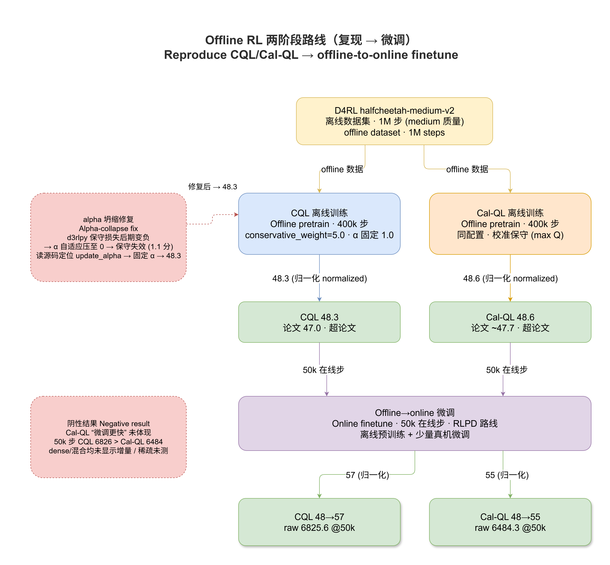

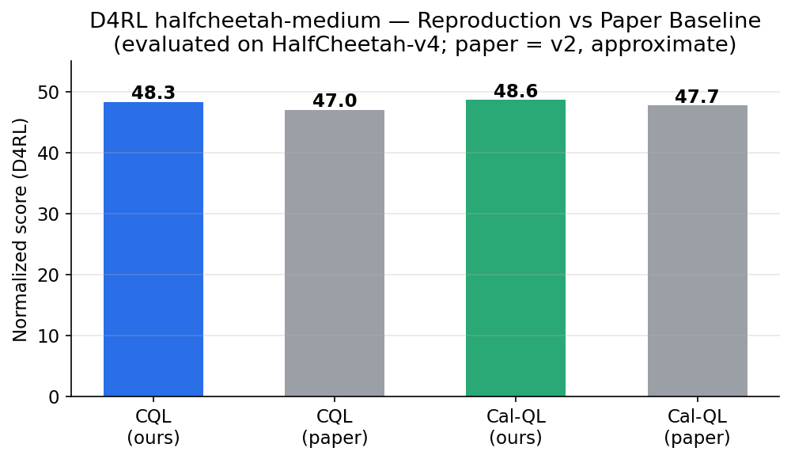
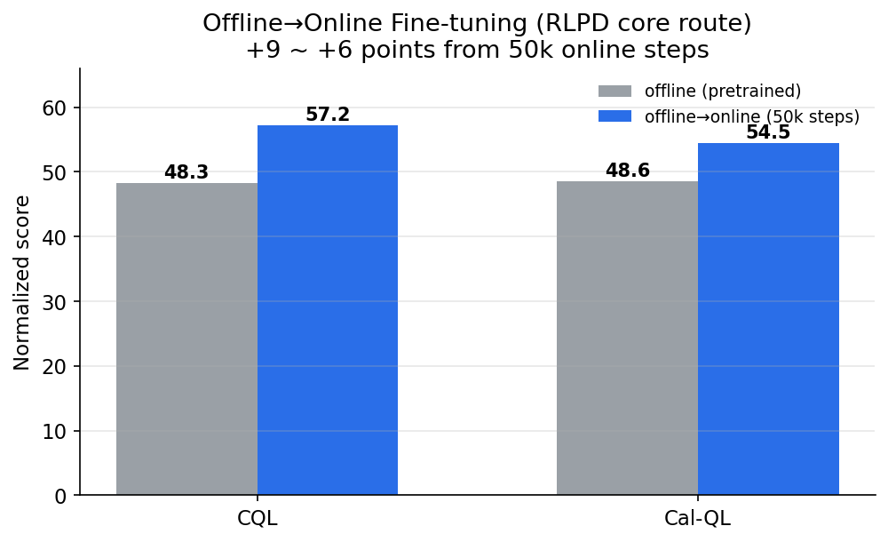
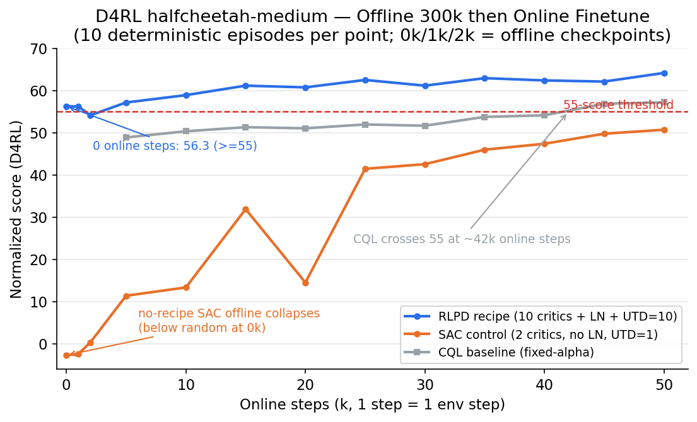
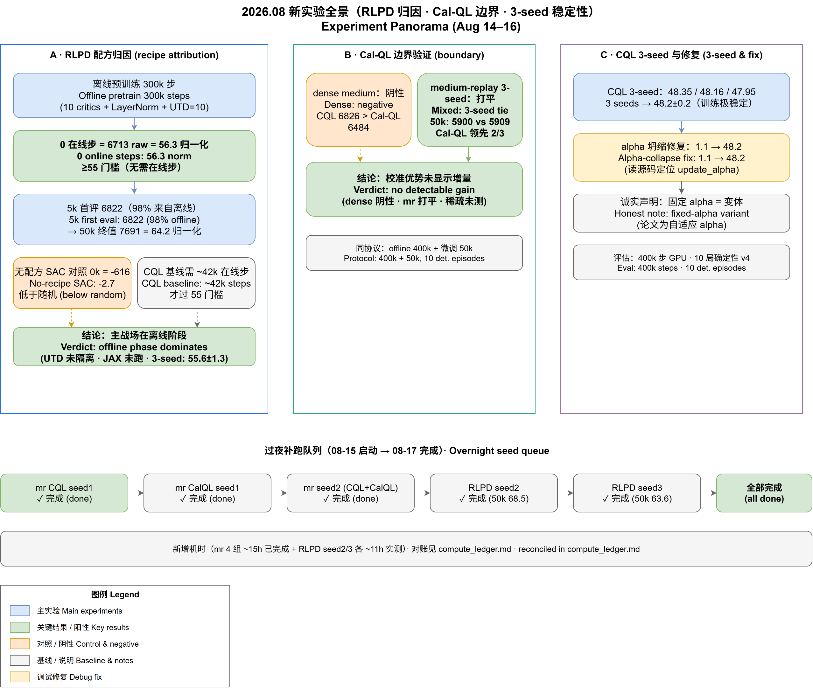

| 结果 | 归一化分数 |
|---|---|
| CQL（复现，固定 alpha 变体） | **48.2 ± 0.2（3 seeds）**（论文 47.0，官方自适应 alpha + 1M 步） |
| Cal-QL（复现，单 seed） | **48.6**（论文 ~47.7） |
| offline→online 微调 | CQL 48→57、Cal-QL 48→55（50k 在线步） |
| **RLPD 风格（10 critics + LN + UTD=10）** | 离线 300k 的 0 在线步评估 **3-seed：56.3 / 54.2 / 56.4（均值 55.6±1.3）**——达 CQL 基线需 ~42k 在线步才有的水平（55 为对照参考线、非任务阈值）；在线 50k 微调终值 **3-seed 均值 65.4±2.7**（64.2 / 68.5 / 63.6） |

> **实跑脚本**：`d4rl/train_rlpd_seeds.py`（UTD=10）；库内 `scripts/train_rlpd.py` 为设计版（UTD=20 参数化说明 + 降级注释）——以 `d4rl/` 实跑脚本为准，复现命令见 `d4rl/README.md`。

- **alpha 坍缩修复**：d3rlpy CQL 保守损失后期变负 → alpha 自适应压至 0 → 保守失效（1.1 分）；读源码定位 `update_alpha` 修复为固定 alpha → 48.3（单 run）。**3-seed 统计**（2026-08-15 补）：seed 0/1/2 归一化 48.35/48.16/47.95，均值 48.2±0.2（raw 5722.5/5698.7/5672.6，同协议 10 局确定性 v4）——训练稳定，见 `d4rl/cql_seed{0,1,2}_eval.json`。**实现差异声明**：固定 alpha 为变体（官方为自适应 alpha 调度）、训练 400k vs 论文常用 1M——"超论文 47.0"为变体对比，非原算法复现
- **阴性结果**：Cal-QL 论文宣称"微调更快"，但 dense-reward 数据上未体现（CQL 6826 vs Cal-QL 6484）。**边界验证 3-seed 下修（2026-08-16）**：混合数据 medium-replay 原单 seed"弱阳性（9/10 点领先、+1 分）"不复现——3 次独立训练（原跑+seed1/2）50k 终值 Cal-QL 5900±137 vs CQL 5909±67（打平，差 −9），逐点领先互有胜负；Cal-QL 校准优势在 dense/混合两类数据均未显示增量，稀疏奖励（antmaze）未测。3-seed 数据见 [results/results_medium_replay.md](results/results_medium_replay.md)。
- **RLPD 配方实证**（2026-08-15，[results/results_rlpd.md](results/results_rlpd.md)）：配方三要素（ensemble+LN+UTD=10）vs 同预算 SAC 对照（2 critics 无 LN UTD=1）——**配方整体有效、价值大头在离线阶段**（ensemble+LN 稳定离线 Q 学习，无配方 SAC 离线直接学废：0k 切分点 -616 raw 低于随机水平）；**离线/在线贡献已用 0k/1k/2k 切分点实测切开（0k：6713 vs -616）、UTD 单独增量未隔离**。边界：offline 300k/UTD=10 为计划降级条款（论文 1M/20），Q 聚合用 mean（论文 REDQ 式 min）

---

## <a id="p4"></a>项目 ④：步态相位估计 + 助力增益（Daphnet 数据集）

公开步态数据集 Daphnet（帕金森患者，踝部 64Hz 加速度计）实现步态事件检测与助力增益原型。

**数据集选型说明**：Daphnet 是公开可得的步态 IMU 标准数据集（可复现性优先）；16/17 段稳定检出，唯一失败段为冻结步态（FoG）前兆段——方法在多数困难段上成立，但对最难场景本身仍失败；健康人常规步态更简单、迁移预期乐观但未经验证，健康人数据集（如 Camargo 外骨骼步态集）验证列为后续工作。

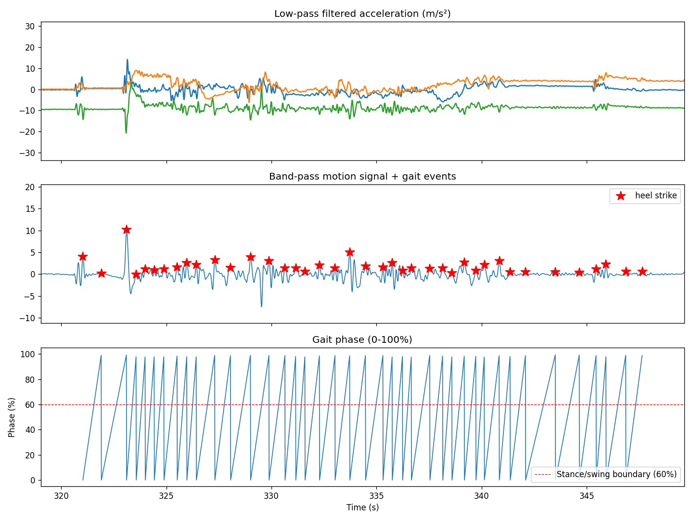
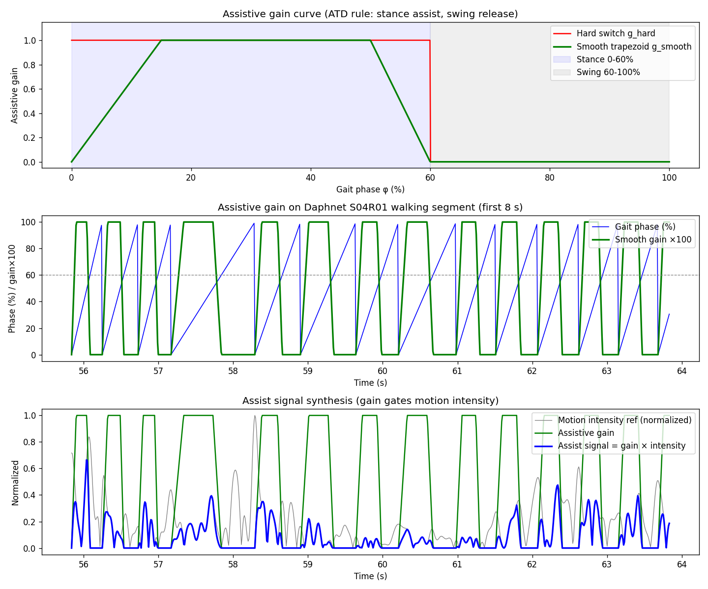

- **16/17 段稳定检出**（≥10 步态事件；唯一失败段为短行走/冻结前兆，仅 8 事件），成功段步频 60-98 步/分
- **助力增益曲线**（作为 ATD 决策的步态相位输入——信号处理原型，距完整 ATD 差控制闭环）：支撑相（0-60%）助力、摆动相释放；硬开关 vs 平滑梯形，平滑梯形保留 78% 助力、消除阶跃冲击

---

## <a id="p4half"></a>项目 ④½：最小人机耦合闭环 —— 相位条件化 H1（Isaac Lab）

把项目④估计器的输出接口（步态相位）接进项目①的控制策略：相位时钟 → 条件化双足策略 → 着地事件锁相 → 相位突变与周期外力下验证。代码在 `phase_conditioned/`（训练/评估脚本 + 检查点权重 + 结果文档可复现）。

**环境改造**（官方 H1 平地环境的子类，PPO 配置与官方 h1_flat 完全一致——2048 envs / 1000 iter / seed 0，唯一变量 = +2 obs 维 +1 reward 项）：
- obs 追加相位时钟 [sin(2πφ), cos(2πφ)]（69→71 维，时钟 1.4 Hz）
- reward 追加相位锁定接触调度项（着地须落在期望支撑窗：左足 φ∈[0,0.5)、右足 φ∈[0.5,1)）

**结果**（10 局/组，默认随机指令调度，与训练分布一致）：

| 指标 | 值 |
|---|---|
| 相位对齐（接触落在期望支撑窗的比例） | 0.986 ± 0.002 |
| 着地频率 vs 时钟频率 | 1.425/1.410 Hz vs 1.40 Hz（锁定） |
| 指令跟踪误差（\|v−cmd\|，同奖励口径） | 0.109 m/s（同协议实测 flat 基线 0.068：无外力下略降，外力下保稳定 > 追命令） |
| 相位突变重同步（1.4→1.9 Hz，t=5s） | 对齐 dip 0.99→0.88，单步级恢复 <0.2s（8/8 局） |
| 周期外力存活率 A=100N（1.4 Hz 共振，torso +x） | 1.00 vs flat 基线 0.70（10 局/格） |
| 周期外力存活率 A=200N | 0.60 vs flat 基线 0.20（10 局/格，6/10 vs 2/10，方向性信号） |

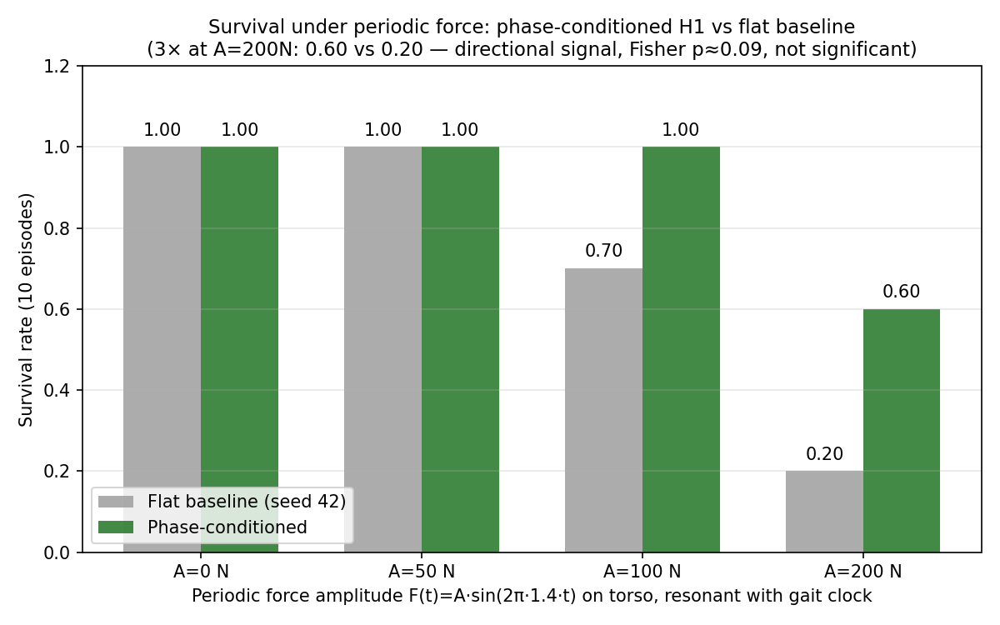

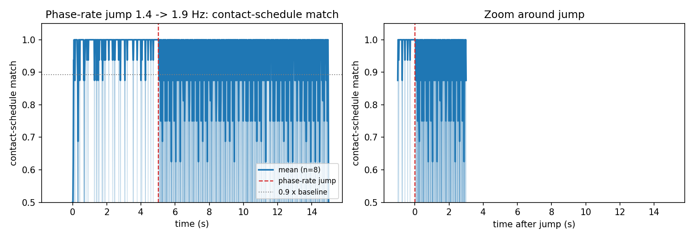

**边界声明**（完整版见 `phase_conditioned/results/phase_closure.md`）：
1. 信号通路级闭环：相位是合成时钟，不是 Daphnet 估计器的在线化输出（接口兼容=同为"当前步态相位"标量；Daphnet 输出离散步态事件，中间需相位变量估计器，在线化列为下一步）
2. 接触调度窗口是人为设定的控制约束，不是数据检出
3. 外力是 torso 上的理想正弦力，非穿戴者-机器人真实交互力（pHRI 需人体在环，未做）
4. 相位策略的跟踪精度整体略低于同协议 flat 基线（A=0：0.109 vs 0.068），外力下差距进一步拉大——保稳定 > 追命令的取舍。

---

## <a id="env"></a>环境

- Windows 11 + RTX 4090 Laptop (16GB) + Intel Ultra 9 185H
- Isaac Sim 5.1.0 + Isaac Lab 2.3.x + RSL-RL 5.0.1（H1）；SB3 / d3rlpy（MuJoCo / D4RL）
- Python 3.11 venv，torch 2.7.0+cu128

## 复现

> 项目①（H1）训练依赖 Isaac Lab 完整环境（体积巨大），训练工程保留在本地；**训练权重（rough `model_2999.pt` / flat `model_999.pt`，共 8MB）经 [GitHub Release](https://github.com/HaoZiOwO/rl-h1-locomotion/releases) 下载**，配合 `scripts/eval_h1_v2.py` 在本地 Isaac 环境复现评估；项目②③④的**训练 / 评估 / 导出 / 绘图脚本均在本仓库 `scripts/`**，数据为公开数据集或仓库内可生成。项目④½（相位条件化闭环）的**训练/评估脚本 + 检查点权重 + 结果文档在 `phase_conditioned/`**，评估复现：`bash phase_conditioned/run_eval_phase.sh --mode steady|jump|sweep --checkpoint phase_conditioned/h1_phase_model_999.pt`。

**项目①（H1）**：
```bash
# 训练（需本地 Isaac Lab 环境，见下方「Windows 环境搭建笔记」；脚本在仓库 scripts/train_custom.py，H1 完整工程保留在本地）
python scripts/train_custom.py --mode rough --num_envs 2048 --max_iterations 3000
# 评估（本仓库 scripts/eval_h1_v2.py 可直接运行）
python scripts/eval_h1_v2.py --task rough --checkpoint <ckpt> --mode curve --levels 0,3,6,9,12,15,18,19
```

**项目②（MuJoCo Humanoid-v4，SB3）**：
```bash
python scripts/train.py             # PPO → ppo_humanoid.zip（2M 步）
python scripts/collect_demos.py     # PPO 教师采集示范 → expert_demos.npz（9913 条，仓库根目录已包含）
python scripts/train_bc.py          # BC → bc_humanoid.pt
python scripts/train_diffusion.py   # Diffusion Policy（DDPM 自实现）→ dp_humanoid.pt
python scripts/train_sac.py         # SAC → sac_humanoid.zip

# 评估（模型权重已包含在仓库根目录）
python scripts/eval_bc.py           # BC → 519.0
python scripts/eval_sac.py          # SAC → 6416.8
python scripts/eval_diffusion.py    # DP → 485.7
python scripts/eval_student.py      # 蒸馏学生（28 维）→ 534.4
```

**项目③（D4RL + d3rlpy）**：数据 halfcheetah-medium-v2（公开，HF 镜像 imone/D4RL 下载 hdf5 放入 `scripts/` 下）
```bash
python scripts/train_offline_cql.py    # CQL 复现 → results/offline_cql.md（48.3，单 run；3-seed 48.2±0.2）
python scripts/train_offline_calql.py  # Cal-QL 复现 → results/offline_calql.md（48.6）
```

**项目④（Daphnet 步态）**：数据 Daphnet Freezing of Gait（UCI 公开，注册下载后放入 `scripts/data/dataset_fog_release/`）
```bash
python scripts/run_daphnet.py          # 步态事件检测 → daphnet_gait.png
```

**所有结果文档见 `results/`。**

## Windows 环境搭建笔记（Isaac Lab 已知痛点 + 根因）

1. `import isaacsim` 需先接受 EULA：`export OMNI_KIT_ACCEPT_EULA=YES`
2. pip 默认装 torch CPU 版 → 必须手动装 cu128：`pip install torch==2.7.0 torchvision==0.22.0 --index-url https://download.pytorch.org/whl/cu128`
3. **tensordict 版本必须匹配 torch**：最新版（0.13）针对 torch 2.9+ 编译，配 torch 2.7 会导入即段错误 → `pip install tensordict==0.8.0`
4. Isaac Lab 2.3 任务已改名：`Isaac-Velocity-Flat-Humanoid-v0` → `Isaac-Velocity-Flat-H1-v0`（Unitree H1）
5. 安装：`pip install "isaacsim[all,extscache]==5.1.0" --extra-index-url https://pypi.nvidia.com`
6. **rsl_rl 5.x 的 obs 是 TensorDict**（`obs["policy"]`），直接 `obs[0]` 索引会 KeyError
7. **gymnasium OrderEnforcing**：step 前必须显式 `env.reset()`，且 reset 需在 `torch.inference_mode()` 内
8. **Isaac Sim 进程异常时 exit code 可能为 0**——判断成败要看日志里有没有 Traceback，不能只看退出码

## Debug 记录

### ① d3rlpy CQL 的 alpha 自适应坍缩（算法 bug）

- **现象**：CQL 训练后分数崩到 1.1（应为 ~48）
- **定位**：读 d3rlpy 源码，`update_alpha` 用**梯度上升**自动调 alpha（Lagrange 对偶）
- **机制**：保守损失后期变负 → alpha 压到 0 → 保守项完全失效
- **修复**：固定 alpha（`alpha_learning_rate=0`）
- **验证**：1.1 → 48.3（单 run；3-seed 48.2±0.2），复现论文 47.0

### ② Isaac Sim Hydra 渲染崩溃（工程 bug，2026-08-06 实测）

**Isaac Sim demo 视频录制暂不可用**（渲染管线崩溃，与训练无关）——**已改用 MuJoCo 自带 rgb_array 离屏渲染录制，见 `assets/demo_sac.mp4`（注意：这是 MuJoCo Humanoid 走路视频，非 H1）**：
- **真实根因**（已用 crash_*.txt 崩溃栈定位）：Isaac Sim 的 **Hydra 渲染引擎创建**崩溃——headless 录视频崩在 `omni::usd::UsdManager::createHydraEngineWithConfig`
- 早期误判为 omni.warp 段错误（只看崩溃栈尾部）；已实测 **warp 本身健康** → 确认是渲染栈问题
- 训练/评估/导出全程 headless 不创建 Hydra 引擎，因此完全不受影响
- **修复方向**：更新 NVIDIA 驱动后重试；或换装其他 Isaac Sim 5.x 小版本

## 作者

📧 jz233w@icloud.com
